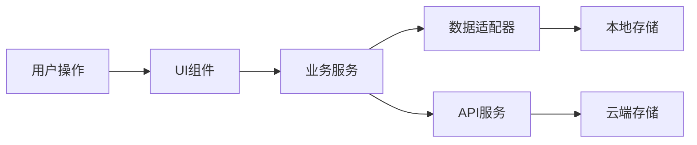

# 单词日记 - 功能升级开发计划

> 版本：v2.0
> 更新日期：2026-01-29
> 项目目标：从"单词管理工具"升级为"完整的英语单词学习系统"

---

## 📋 目录

- [一、高优先级功能（第一阶段）](#一高优先级功能第一阶段)
- [二、中优先级功能（第二阶段）](#二中优先级功能第二阶段)
- [三、技术架构设计](#三技术架构设计)
- [四、数据结构设计](#四数据结构设计)
- [五、开发路线图](#五开发路线图)
- [六、测试计划](#六测试计划)

---

## 一、高优先级功能（第一阶段）

### 1. ✨ 单词例句系统

#### 📝 功能需求

**核心功能**
- [ ] 自动获取单词例句（集成第三方API）
- [ ] 用户自定义例句
- [ ] 例句翻译显示
- [ ] 例句发音播放
- [ ] 例句收藏/标记

**详细需求**
```yaml
例句来源:
  - API集成: Youdao/ICIBA/Tatoeba
  - 用户自定义: 支持手动添加
  - 词库自带: 常用词汇预置例句

例句展示:
  - 每个单词显示 2-3 个精选例句
  - 英文例句 + 中文翻译
  - 例句来源标注
  - 难度等级标记（1-5星）

交互功能:
  - 点击播放例句发音
  - 长按例句显示操作菜单
  - 支持例句编辑和删除
  - 例句搜索和筛选
```

#### 🏗️ 技术实现

**数据结构**
```javascript
// 单词例句数据结构
{
  _id: "word_1234567890",
  word: "ephemeral",
  translation: "短暂的",
  examples: [
    {
      id: "ex_001",
      sentence_en: "Fashions are ephemeral, changing with every season.",
      sentence_zh: "时尚是短暂的，每个季节都在变化。",
      source: "youdao", // youdao | iciba | user | tatoeba
      audio_url: "https://...",
      difficulty: 4, // 1-5
      created_at: 1706500800000,
      is_favorite: false
    }
  ],
  // ... 其他字段
}
```

**API集成方案**
```javascript
// 例句API服务
class ExampleService {
  // 优先级：本地 > 用户 > 第三方API
  async getExamples(word) {
    // 1. 检查本地缓存
    const cached = await this.getLocalExamples(word)
    if (cached?.length >= 2) return cached

    // 2. 调用第三方API
    const apiExamples = await Promise.all([
      this.fetchYoudao(word),
      this.fetchICIBA(word),
      this.fetchTatoeba(word)
    ])

    // 3. 合并去重，按难度排序
    return this.mergeAndSort(apiExamples)
  }

  async fetchYoudao(word) {
    // 有道API实现
  }

  async fetchICIBA(word) {
    // 金山词霸API实现
  }
}
```

**UI组件设计**
```vue
<!-- ExampleDisplay.vue -->
<template>
  <div class="example-section">
    <div class="section-header">
      <h4>例句</h4>
      <button @click="addExample" class="btn-add">
        + 添加例句
      </button>
    </div>

    <div class="example-list">
      <div
        v-for="ex in examples"
        :key="ex.id"
        class="example-item"
        :class="{ favorite: ex.is_favorite }"
      >
        <div class="example-content">
          <span class="difficulty-badge" :data-level="ex.difficulty">
            {{ '★'.repeat(ex.difficulty) }}
          </span>
          <p class="sentence-en">{{ ex.sentence_en }}</p>
          <p class="sentence-zh">{{ ex.sentence_zh }}</p>
          <span class="source-badge">{{ ex.source }}</span>
        </div>

        <div class="example-actions">
          <button @click="playAudio(ex)" class="btn-icon">
            🔊
          </button>
          <button @click="toggleFavorite(ex)" class="btn-icon">
            {{ ex.is_favorite ? '⭐' : '☆' }}
          </button>
          <button @click="editExample(ex)" class="btn-icon">
            ✏️
          </button>
          <button @click="deleteExample(ex)" class="btn-icon danger">
            🗑️
          </button>
        </div>
      </div>
    </div>
  </div>
</template>
```

**开发工作量估算**
- 后端API集成：2-3天
- 前端组件开发：2-3天
- UI设计和优化：1-2天
- 测试和bug修复：1-2天
- **总计：6-10天**

---

### 2. 📊 学习数据可视化

#### 📝 功能需求

**核心功能**
- [ ] 学习日历（打卡记录）
- [ ] 每周/每月学习报告
- [ ] 单词掌握度分析
- [ ] 学习时长统计
- [ ] 复习完成率曲线
- [ ] 单词难度分布图

**详细需求**
```yaml
学习日历:
  - 热力图显示学习活跃度
  - 颜色深浅表示学习强度
  - 点击查看当日详情
  - 连续打卡天数统计

统计图表:
  - 折线图: 学习趋势（单词增长、复习次数）
  - 雷达图: 能力维度（词汇量、记忆率、学习时长）
  - 饼图: 记忆状态分布（新词/学习/巩固/掌握）
  - 柱状图: 每日学习量对比

学习报告:
  - 周报: 本周学习数据总结
  - 月报: 月度进步分析
  - 同比: 与上月数据对比
  - 排名: 与历史最好成绩对比
```

#### 🏗️ 技术实现

**数据收集**
```javascript
// 学习记录数据结构
{
  _id: "log_20250129",
  date: "2025-01-29",
  user_id: "user_001",
  activities: [
    {
      type: "add", // add | review | practice
      timestamp: 1706500800000,
      word_id: "word_001",
      result: "success" // success | failed | partial
    }
  ],
  summary: {
    total_words: 150,
    new_words: 20,
    reviewed_words: 50,
    practice_time: 1800, // 秒
    accuracy: 0.85
  }
}
```

**统计服务**
```javascript
class StatisticsService {
  // 获取学习日历数据
  async getLearningCalendar(days = 365) {
    const logs = await this.getLogs(days)
    return logs.map(log => ({
      date: log.date,
      intensity: this.calculateIntensity(log.summary),
      isNewRecord: this.checkIfNewRecord(log.summary)
    }))
  }

  // 计算学习强度（0-5级）
  calculateIntensity(summary) {
    const score =
      (summary.new_words * 2) +
      (summary.reviewed_words * 1) +
      (summary.practice_time / 60) * 0.5

    return Math.min(5, Math.floor(score / 20))
  }

  // 生成周报
  async generateWeeklyReport() {
    const weekLogs = await this.getLogs(7)
    return {
      total_words: this.sum(weekLogs, 'total_words'),
      active_days: weekLogs.filter(l => l.activities.length > 0).length,
      streak: this.calculateStreak(weekLogs),
      best_day: this.findBestDay(weekLogs),
      improvement: this.calculateImprovement(weekLogs)
    }
  }
}
```

**UI组件设计**
```vue
<!-- StatisticsDashboard.vue -->
<template>
  <div class="stats-dashboard">
    <!-- 学习日历 -->
    <div class="calendar-section card">
      <h3>📅 学习日历</h3>
      <div class="stats-overview">
        <div class="stat-item">
          <span class="stat-value">{{ streak }}天</span>
          <span class="stat-label">连续打卡</span>
        </div>
        <div class="stat-item">
          <span class="stat-value">{{ totalWords }}</span>
          <span class="stat-label">单词总数</span>
        </div>
        <div class="stat-item">
          <span class="stat-value">{{ totalTime }}h</span>
          <span class="stat-label">学习时长</span>
        </div>
      </div>
      <CalendarHeatmap :data="calendarData" />
    </div>

    <!-- 掌握度分析 -->
    <div class="mastery-section card">
      <h3>📊 掌握度分析</h3>
      <MasteryChart :data="masteryData" />
    </div>

    <!-- 学习趋势 -->
    <div class="trend-section card">
      <h3>📈 学习趋势</h3>
      <TrendChart :data="trendData" />
    </div>

    <!-- 难度分布 -->
    <div class="difficulty-section card">
      <h3>🎯 单词难度分布</h3>
      <DifficultyChart :data="difficultyData" />
    </div>

    <!-- 每周报告 -->
    <div class="report-section card">
      <h3>📝 本周报告</h3>
      <WeeklyReport :data="weeklyReport" />
    </div>
  </div>
</template>
```

**开发工作量估算**
- 数据收集和存储：1-2天
- 统计服务开发：2-3天
- 图表组件开发：3-4天
- UI设计和布局：2天
- 测试和优化：1-2天
- **总计：9-13天**

---

### 3. 🎯 多种复习模式

#### 📝 功能需求

**核心模式**
- [ ] 翻卡片模式（现有）
- [ ] 单词拼写模式
- [ ] 听音辨义模式
- [ ] 例句填空模式
- [ ] 选择题模式
- [ ] 口语跟读模式

**详细需求**
```yaml
翻译模式:
  - 显示单词/翻译
  - 翻转查看答案
  - 评分（0-5）

拼写模式:
  - 显示翻译/例句
  - 输入完整单词
  - 实时检查拼写
  - 提示首字母/长度

听音模式:
  - 播放单词发音
  - 输入或选择正确翻译
  - 重复播放功能
  - 语速调节（0.5x-2x）

选择题模式:
  - 显示单词/翻译
  - 4个选项
  - 即时反馈
  - 错题解析

填空模式:
  - 显示含生词的例句
  - 单词处挖空
  - 输入正确单词
  - 上下文提示

跟读模式:
  - 播放原声发音
  - 录制用户发音
  - AI评分（可选）
  - 发音对比
```

#### 🏗️ 技术实现

**复习模式管理器**
```javascript
// 复习模式枚举
const REVIEW_MODES = {
  FLASHCARD: 'flashcard',
  SPELLING: 'spelling',
  LISTENING: 'listening',
  MULTIPLE_CHOICE: 'multiple_choice',
  FILL_BLANK: 'fill_blank',
  SHADOWING: 'shadowing'
}

// 复习模式基类
class ReviewMode {
  constructor(session, word) {
    this.session = session
    this.word = word
    this.userAnswer = null
    this.isCorrect = false
    this.responseTime = 0
  }

  async render() {
    throw new Error('Must implement render()')
  }

  async checkAnswer() {
    throw new Error('Must implement checkAnswer()')
  }

  async getFeedback() {
    throw new Error('Must implement getFeedback()')
  }
}

// 拼写模式
class SpellingMode extends ReviewMode {
  render() {
    return {
      type: 'spelling',
      question: this.word.translation,
      hint: `${this.word.word[0]}${'_'.repeat(this.word.word.length - 1)}`,
      length: this.word.word.length
    }
  }

  checkAnswer(userInput) {
    this.userAnswer = userInput
    this.isCorrect = userInput.toLowerCase() === this.word.word.toLowerCase()
    return this.isCorrect
  }

  getFeedback() {
    return {
      correct: this.isCorrect,
      correctAnswer: this.word.word,
      userAnswer: this.userAnswer,
      message: this.isCorrect ? '✅ 完全正确！' : '❌ 正确答案：' + this.word.word
    }
  }
}

// 听音模式
class ListeningMode extends ReviewMode {
  render() {
    return {
      type: 'listening',
      audioUrl: this.word.audio_url,
      options: this.generateOptions()
    }
  }

  generateOptions() {
    // 生成3个干扰项
    const distractors = this.session.getDistractors(this.word, 3)
    return this.shuffle([
      { id: this.word._id, text: this.word.translation, correct: true },
      ...distractors.map(d => ({ id: d._id, text: d.translation, correct: false }))
    ])
  }
}
```

**复习会话管理**
```javascript
class ReviewSession {
  constructor(words, mode, options = {}) {
    this.words = words
    this.mode = mode
    this.currentIndex = 0
    this.results = []

    this.sessionConfig = {
      autoPlayAudio: options.autoPlayAudio ?? false,
      showHint: options.showHint ?? true,
      allowSkip: options.allowSkip ?? true
    }
  }

  getCurrentWord() {
    return this.words[this.currentIndex]
  }

  next() {
    if (this.currentIndex < this.words.length - 1) {
      this.currentIndex++
      return true
    }
    return false
  }

  recordResult(result) {
    this.results.push({
      word_id: this.getCurrentWord()._id,
      is_correct: result.isCorrect,
      response_time: result.responseTime,
      timestamp: Date.now()
    })
  }

  getSummary() {
    const total = this.results.length
    const correct = this.results.filter(r => r.is_correct).length
    return {
      total,
      correct,
      accuracy: total > 0 ? correct / total : 0,
      average_time: this.results.reduce((sum, r) => sum + r.response_time, 0) / total
    }
  }
}
```

**UI组件设计**
```vue
<!-- ReviewSession.vue -->
<template>
  <div class="review-session">
    <!-- 进度条 -->
    <div class="progress-section">
      <ProgressBar :current="currentIndex + 1" :total="words.length" />
    </div>

    <!-- 复习模式选择器 -->
    <div v-if="showModeSelector" class="mode-selector">
      <h4>选择复习模式</h4>
      <div class="mode-grid">
        <button
          v-for="mode in modes"
          :key="mode.id"
          @click="selectMode(mode.id)"
          class="mode-card"
        >
          <span class="mode-icon">{{ mode.icon }}</span>
          <span class="mode-name">{{ mode.name }}</span>
          <span class="mode-desc">{{ mode.description }}</span>
        </button>
      </div>
    </div>

    <!-- 复习界面 -->
    <div v-else class="review-area">
      <!-- 根据不同模式渲染不同界面 -->
      <FlashcardMode
        v-if="currentMode === 'flashcard'"
        :word="currentWord"
        @answer="handleAnswer"
      />

      <SpellingMode
        v-else-if="currentMode === 'spelling'"
        :word="currentWord"
        @submit="handleAnswer"
      />

      <ListeningMode
        v-else-if="currentMode === 'listening'"
        :word="currentWord"
        @answer="handleAnswer"
      />

      <MultipleChoiceMode
        v-else-if="currentMode === 'multiple_choice'"
        :word="currentWord"
        @answer="handleAnswer"
      />

      <!-- 反馈弹窗 -->
      <FeedbackModal
        v-if="showFeedback"
        :result="lastResult"
        @continue="nextWord"
        @retry="retryCurrent"
      />
    </div>
  </div>
</template>
```

**开发工作量估算**
- 复习模式框架设计：1-2天
- 拼写模式开发：2天
- 听音模式开发：2-3天
- 选择题模式开发：2天
- 填空模式开发：2-3天
- UI组件开发：3-4天
- 测试和优化：2-3天
- **总计：14-17天**

---

### 4. ⏰ 智能复习提醒

#### 📝 功能需求

**核心功能**
- [ ] 基于遗忘曲线的智能提醒
- [ ] 每日学习目标提醒
- [ ] 复习截止时间提醒
- [ ] 长期未学习唤醒
- [ ] 提醒时间自定义

**详细需求**
```yaml
智能提醒算法:
  - 根据SM-2算法计算下次复习时间
  - 提前30分钟提醒
  - 复习截止前1小时提醒
  - 遗忘高风险单词重点提醒

提醒方式:
  - uTools通知
  - 系统通知（需权限）
  - 应用内横幅

提醒类型:
  - 每日复习提醒（固定时间）
  - 批量复习提醒（单词累积到阈值）
  - 学习目标提醒（每日目标未完成）
  - 回忆提醒（即将遗忘的单词）

提醒设置:
  - 开关控制
  - 时间设置
  - 频率设置
  - 免打扰时段
```

#### 🏗️ 技术实现

**提醒服务**
```javascript
class ReminderService {
  constructor() {
    this.reminders = []
    this.settings = {
      enabled: true,
      dailyReviewTime: '09:00',
      dailyGoal: 20,
      quietHours: { start: '22:00', end: '08:00' }
    }
  }

  // 计算下次复习时间
  calculateNextReview(word) {
    const now = Date.now()
    const nextReviewTime = word.next_review_date || now

    // 提前30分钟提醒
    return {
      reminderTime: nextReviewTime - 30 * 60 * 1000,
      deadlineTime: nextReviewTime,
      wordId: word._id
    }
  }

  // 检查是否需要提醒
  async checkReminders() {
    const now = Date.now()

    // 检查复习提醒
    const dueWords = await this.getDueWords()
    if (dueWords.length > 0) {
      this.scheduleReminder({
        type: 'review',
        time: now + 5 * 60 * 1000, // 5分钟后
        data: { count: dueWords.length }
      })
    }

    // 检查每日目标
    const todayProgress = await this.getTodayProgress()
    if (todayProgress.completed < this.settings.dailyGoal) {
      // 在设定时间提醒
      this.scheduleReminder({
        type: 'daily_goal',
        time: this.getTodayReviewTime(),
        data: {
          goal: this.settings.dailyGoal,
          completed: todayProgress.completed
        }
      })
    }
  }

  // 发送通知
  async sendNotification(reminder) {
    const { type, data } = reminder

    let title, message

    switch (type) {
      case 'review':
        title = '📚 复习提醒'
        message = `您有 ${data.count} 个单词需要复习`
        break
      case 'daily_goal':
        title = '🎯 每日目标'
        message = `今日已完成 ${data.completed}/${data.goal} 个单词，加油！`
        break
      case 'deadline':
        title = '⏰ 复习截止'
        message = '部分单词即将到达复习截止时间'
        break
      default:
        title = '单词日记'
        message = '您有新的学习任务'
    }

    if (window.utools?.notify) {
      window.utools.notify(title, message)
    }
  }

  // 调度提醒
  scheduleReminder(reminder) {
    const delay = reminder.time - Date.now()

    if (delay > 0 && this.isInQuietHours(reminder.time)) {
      setTimeout(() => {
        this.sendNotification(reminder)
      }, delay)
    }
  }

  // 检查是否在免打扰时段
  isInQuietHours(timestamp) {
    const hour = new Date(timestamp).getHours()
    const { start, end } = this.settings.quietHours
    return hour >= parseInt(start) || hour < parseInt(end)
  }
}
```

**UI组件设计**
```vue
<!-- ReminderSettings.vue -->
<template>
  <div class="reminder-settings">
    <div class="setting-card">
      <h3>⏰ 提醒设置</h3>

      <!-- 开关 -->
      <div class="setting-item">
        <label>启用提醒</label>
        <ToggleSwitch v-model="settings.enabled" />
      </div>

      <!-- 每日复习时间 -->
      <div class="setting-item">
        <label>每日复习时间</label>
        <input
          v-model="settings.dailyReviewTime"
          type="time"
          class="time-input"
        />
      </div>

      <!-- 每日目标 -->
      <div class="setting-item">
        <label>每日目标（单词数）</label>
        <NumberInput
          v-model="settings.dailyGoal"
          :min="5"
          :max="100"
          :step="5"
        />
      </div>

      <!-- 免打扰时段 -->
      <div class="setting-item">
        <label>免打扰时段</label>
        <div class="time-range">
          <input
            v-model="settings.quietHours.start"
            type="time"
          />
          <span>至</span>
          <input
            v-model="settings.quietHours.end"
            type="time"
          />
        </div>
      </div>

      <!-- 提醒频率 -->
      <div class="setting-item">
        <label>提醒频率</label>
        <select v-model="settings.frequency">
          <option value="low">低（仅重要提醒）</option>
          <option value="medium">中（平衡）</option>
          <option value="high">高（频繁提醒）</option>
        </select>
      </div>

      <!-- 测试通知 -->
      <button @click="testNotification" class="btn-secondary">
        🔔 测试通知
      </button>
    </div>
  </div>
</template>
```

**开发工作量估算**
- 提醒服务开发：2-3天
- 算法优化：1-2天
- UI设置页面：1-2天
- 通知集成：1天
- 测试和调试：1-2天
- **总计：6-10天**

---

### 5. 📚 单词本功能

#### 📝 功能需求

**核心功能**
- [ ] 创建多个单词本
- [ ] 单词本文件夹管理
- [ ] 单词本分享功能
- [ ] 订阅公开单词本
- [ ] 导入词库（GRE/TOEFL/IELTS）

**详细需求**
```yaml
单词本管理:
  - 创建/删除/重命名单词本
  - 单词本图标和颜色自定义
  - 单词本描述和备注
  - 单词本排序
  - 文件夹分组管理

单词分配:
  - 保存时选择单词本
  - 批量移动单词
  - 复制单词到多个单词本
  - 从单词本移除（不删除单词）

导入导出:
  - 导入Anki词库
  - 导入CSV/Excel
  - 导入TXT（每行一个单词）
  - 导出为各种格式
  - 词库市场（可选）
```

#### 🏗️ 技术实现

**数据结构**
```javascript
// 单词本数据结构
{
  _id: "notebook_001",
  name: "托福核心词汇",
  description: "托福考试必备词汇",
  icon: "📖",
  color: "#FF9F43",
  folder_id: "folder_001",
  word_count: 100,
  created_at: 1706500800000,
  updated_at: 1706500800000,
  is_default: false,
  is_public: false,
  share_code: "ABC123" // 分享码
}

// 文件夹数据结构
{
  _id: "folder_001",
  name: "考试词汇",
  color: "#409eff",
  created_at: 1706500800000
}
```

**单词本服务**
```javascript
class NotebookService {
  // 创建单词本
  async createNotebook(data) {
    const notebook = {
      _id: this.generateId('notebook'),
      name: data.name,
      description: data.description || '',
      icon: data.icon || '📖',
      color: data.color || '#FF9F43',
      folder_id: data.folder_id || null,
      word_count: 0,
      created_at: Date.now(),
      updated_at: Date.now(),
      is_default: false,
      is_public: data.is_public || false,
      share_code: this.generateShareCode()
    }

    await window.utools.db.put(notebook)
    return notebook
  }

  // 生成分享码
  generateShareCode() {
    return Math.random().toString(36).substr(2, 8).toUpperCase()
  }

  // 添加单词到单词本
  async addWordToNotebook(notebookId, wordId) {
    const notebook = await window.utools.db.get(notebookId)

    if (!notebook.words) {
      notebook.words = []
    }

    if (!notebook.words.includes(wordId)) {
      notebook.words.push(wordId)
      notebook.word_count = notebook.words.length
      notebook.updated_at = Date.now()

      await window.utools.db.put(notebook)
    }

    return notebook
  }

  // 批量导入单词
  async importWords(notebookId, words, format) {
    const results = {
      success: 0,
      failed: 0,
      errors: []
    }

    for (const word of words) {
      try {
        // 检查单词是否已存在
        const existing = await window.services.wordExists(word.word)

        if (existing) {
          // 添加到单词本但不创建新单词
          await this.addWordToNotebook(notebookId, existing._id)
        } else {
          // 创建新单词
          const newWord = await window.services.saveWord({
            word: word.word,
            translation: word.translation,
            notebook_id: notebookId
          })

          await this.addWordToNotebook(notebookId, newWord._id)
        }

        results.success++
      } catch (error) {
        results.failed++
        results.errors.push({
          word: word.word,
          error: error.message
        })
      }
    }

    return results
  }

  // 导入Anki词库
  async importFromAnki(file) {
    // 解析Anki格式
    // Anki格式: word, translation, example, tags
    const words = await this.parseAnkiFile(file)
    return this.importWords(this.currentNotebook, words, 'anki')
  }

  // 导出为分享码
  async generateShareCode(notebookId) {
    const notebook = await window.utools.db.get(notebookId)
    const words = await this.getNotebookWords(notebookId)

    const shareData = {
      name: notebook.name,
      description: notebook.description,
      words: words.map(w => ({
        word: w.word,
        translation: w.translation
      }))
    }

    // 压缩并编码
    const compressed = LZString.compressToEncodedURIComponent(JSON.stringify(shareData))
    return compressed
  }

  // 订阅单词本
  async subscribeNotebook(shareCode) {
    // 解码分享数据
    const data = JSON.parse(LZString.decompressFromEncodedURIComponent(shareCode))

    // 创建订阅的单词本
    const notebook = await this.createNotebook({
      name: data.name + ' (订阅)',
      description: data.description,
      is_public: false
    })

    // 导入单词
    return this.importWords(notebook._id, data.words, 'subscription')
  }
}
```

**UI组件设计**
```vue
<!-- NotebookManager.vue -->
<template>
  <div class="notebook-manager">
    <!-- 文件夹树 -->
    <div class="folder-tree">
      <FolderTree
        :folders="folders"
        :notebooks="notebooks"
        @select="handleSelect"
        @drop="handleDrop"
      />
    </div>

    <!-- 单词本列表 -->
    <div class="notebook-list">
      <div class="list-header">
        <h3>我的单词本</h3>
        <button @click="createNotebook" class="btn-primary">
          + 新建单词本
        </button>
      </div>

      <div class="notebook-grid">
        <div
          v-for="nb in notebooks"
          :key="nb._id"
          class="notebook-card"
          @click="openNotebook(nb)"
          :class="{ active: selectedNotebook?._id === nb._id }"
        >
          <div class="notebook-icon" :style="{ background: nb.color }">
            {{ nb.icon }}
          </div>
          <h4>{{ nb.name }}</h4>
          <p>{{ nb.word_count }} 个单词</p>
          <div class="notebook-actions">
            <button @click.stop="editNotebook(nb)" class="btn-icon">✏️</button>
            <button @click.stop="shareNotebook(nb)" class="btn-icon">📤</button>
            <button @click.stop="deleteNotebook(nb)" class="btn-icon danger">🗑️</button>
          </div>
        </div>

        <!-- 添加卡片 -->
        <div class="notebook-card add-new" @click="createNotebook">
          <div class="add-icon">+</div>
          <p>新建单词本</p>
        </div>
      </div>
    </div>

    <!-- 导入导出 -->
    <div class="import-export-section">
      <h3>📥 导入词库</h3>
      <div class="import-methods">
        <button @click="importFromAnki" class="btn-secondary">
          从Anki导入
        </button>
        <button @click="importFromCSV" class="btn-secondary">
          从CSV导入
        </button>
        <button @click="importFromTXT" class="btn-secondary">
          从TXT导入
        </button>
        <button @click="importFromShareCode" class="btn-secondary">
          从分享码导入
        </button>
      </div>
    </div>
  </div>
</template>
```

**开发工作量估算**
- 单词本核心功能：2-3天
- 文件夹管理：1-2天
- 导入导出功能：3-4天
- UI组件开发：3-4天
- 测试和优化：1-2天
- **总计：10-15天**

---

## 二、中优先级功能（第二阶段）

### 1. 🎖️ 成就系统

#### 📝 功能需求

```yaml
成就类型:
  连续学习:
    - 坚持到底: 连续学习7天
    - 学习达人: 连续学习30天
    - 学习王者: 连续学习100天

  里程碑:
    - 初学者: 学会100个单词
    - 进阶者: 学会500个单词
    - 专家: 学会1000个单词
    - 大师: 学会5000个单词

  复习成就:
    - 复习新手: 完成100次复习
    - 复习专家: 完成1000次复习
    - 完美记忆: 复习准确率100%

  特殊成就:
    - 夜猫子: 凌晨还在学习
    - 早起鸟: 6点前开始学习
    - 收藏家: 收藏100个单词

徽章系统:
  - 成就解锁徽章
  - 徽章展示墙
  - 徽章分享功能
```

**数据结构**
```javascript
{
  _id: "achievement_001",
  id: "streak_7",
  name: "坚持到底",
  description: "连续学习7天",
  icon: "🔥",
  category: "streak",
  requirement: {
    type: "consecutive_days",
    value: 7
  },
  reward: {
    points: 100,
    badge: "🔥"
  }
}
```

**开发工作量估算**：8-12天

---

### 2. 📝 学习笔记

#### 📝 功能需求

```yaml
笔记功能:
  - 为单词添加学习笔记
  - 富文本编辑（加粗、高亮等）
  - 添加图片和链接
  - 笔记搜索
  - 笔记导出

笔记模板:
  - 词根词缀笔记
  - 搭配笔记
  - 例句笔记
  - 考点笔记
```

**开发工作量估算**：5-7天

---

### 3. 🔊 听写模式

#### 📝 功能需求

```yaml
听写训练:
  - 播放单词发音
  - 用户输入拼写
  - 实时检查
  - 错误提示
  - 统计准确率
```

**开发工作量估算**：4-6天

---

### 4. 🌟 星级标记

#### 📝 功能需求

```yaml
星级系统:
  - 1-5星难度标记
  - 快速筛选
  - 批量标记
  - 星级统计

特殊标记:
  - 收藏（⭐）
  - 难词（💪）
  - 易错词（❌）
  - 已掌握（✅）
```

**开发工作量估算**：3-4天

---

### 5. 📤 云同步

#### 📝 功能需求

```yaml
云同步功能:
  - 多设备数据同步
  - 自动备份
  - 冲突解决
  - 同步状态显示
  - 离线支持

数据安全:
  - 数据加密
  - 隐私保护
  - 定期备份
```

**开发工作量估算**：10-15天

---

## 三、技术架构设计

### 前端架构

```
src/
├── components/           # 通用组件
│   ├── charts/          # 图表组件
│   ├── calendar/        # 日历组件
│   ├── flashcard/       # 翻卡片组件
│   └── modal/           # 弹窗组件
├── views/               # 页面视图
│   ├── Study/           # 学习中心
│   ├── Statistics/      # 数据统计
│   └── Achievements/    # 成就系统
├── services/            # 业务服务
│   ├── ReviewService.js
│   ├── StatisticsService.js
│   ├── NotebookService.js
│   └── ReminderService.js
├── utils/               # 工具函数
│   ├── date.js          # 日期处理
│   ├── storage.js       # 存储封装
│   └── charts.js        # 图表配置
└── stores/              # 状态管理
    ├── word.js
    ├── study.js
    └── settings.js
```

### 数据流架构



### 状态管理

```javascript
// Pinia stores
export const useStudyStore = defineStore('study', {
  state: () => ({
    currentSession: null,
    studyHistory: [],
    statistics: null,
    goals: {}
  }),

  actions: {
    async startSession(mode, words) { },
    async recordResult(result) { },
    async getStatistics() { }
  }
})
```

---

## 四、数据结构设计

### 核心数据表

```javascript
// 1. 单词表（扩展现有）
{
  _id: "word_xxx",
  word: "ephemeral",
  translation: "短暂的",
  phonetic: {
    uk: "/ɪˈfemərəl/",
    us: "/ɪˈfemərəl/"
  },
  examples: [
    {
      sentence_en: "Fashions are ephemeral.",
      sentence_zh: "时尚是短暂的。",
      source: "youdao",
      audio_url: "https://...",
      difficulty: 4
    }
  ],
  etymology: "希腊语",
  synonyms: ["transient", "fleeting"],
  antonyms: ["permanent"],
  collocations: ["ephemeral pleasure"],
  notes: "容易和eternal混淆",
  difficulty: 4,
  frequency: "B2",
  tags: ["托福", "形容词"],
  notebook_id: "notebook_001",
  star_rating: 4,
  is_favorite: false,
  created_at: 1706500800000,
  updated_at: 1706500800000
}

// 2. 学习记录表
{
  _id: "log_xxx",
  user_id: "user_001",
  date: "2025-01-29",
  activities: [
    {
      type: "review",
      word_id: "word_001",
      mode: "flashcard",
      result: "success",
      response_time: 3000,
      timestamp: 1706500800000
    }
  ],
  summary: {
    total_words: 150,
    new_words: 20,
    reviewed_words: 50,
    practice_time: 1800,
    accuracy: 0.85
  }
}

// 3. 单词本表
{
  _id: "notebook_xxx",
  name: "托福核心词汇",
  description: "托福必备",
  icon: "📖",
  color: "#FF9F43",
  folder_id: "folder_001",
  words: ["word_001", "word_002"],
  word_count: 100,
  created_at: 1706500800000,
  updated_at: 1706500800000,
  is_default: false,
  is_public: false,
  share_code: "ABC123"
}

// 4. 成就表
{
  _id: "achievement_xxx",
  user_id: "user_001",
  achievement_id: "streak_7",
  unlocked_at: 1706500800000,
  progress: 7
}

// 5. 设置表
{
  _id: "settings_xxx",
  user_id: "user_001",
  study: {
    daily_goal: 20,
    preferred_mode: "flashcard",
    auto_play_audio: true
  },
  reminder: {
    enabled: true,
    daily_time: "09:00",
    frequency: "medium",
    quiet_hours: {
      start: "22:00",
      end: "08:00"
    }
  }
}
```

---

## 五、开发路线图

### 第一阶段（高优先级）- 6-8周

**Week 1-2: 基础设施**
- [ ] 项目架构重构
- [ ] 数据结构升级
- [ ] 服务层设计
- [ ] 状态管理搭建

**Week 3-4: 单词例句系统**
- [ ] API集成
- [ ] 例句管理UI
- [ ] 发音功能
- [ ] 测试优化

**Week 5-6: 复习模式扩展**
- [ ] 复习模式框架
- [ ] 拼写模式
- [ ] 听音模式
- [ ] 选择题模式

**Week 7-8: 数据可视化**
- [ ] 数据收集
- [ ] 图表组件
- [ ] 统计仪表盘
- [ ] 学习日历

**Week 9-10: 提醒和单词本**
- [ ] 智能提醒系统
- [ ] 单词本管理
- [ ] 导入导出功能
- [ ] 测试发布

### 第二阶段（中优先级）- 4-6周

**Week 11-12: 成就和笔记**
- [ ] 成就系统
- [ ] 学习笔记
- [ ] 徽章系统

**Week 13-14: 高级功能**
- [ ] 听写模式
- [ ] 星级标记
- [ ] 云同步

**Week 15-16: 优化和发布**
- [ ] 性能优化
- [ ] UI优化
- [ ] 全面测试
- [ ] 正式发布

---

## 六、测试计划

### 单元测试

```javascript
// 复习服务测试
describe('ReviewService', () => {
  test('should calculate next review interval correctly', () => {
    const service = new ReviewService()
    const result = service.calculateNextReview({
      interval: 1,
      easeFactor: 2.5,
      quality: 4
    })
    expect(result.interval).toBeGreaterThan(1)
  })
})
```

### 集成测试

```javascript
// 学习流程测试
describe('Study Flow', () => {
  test('complete study session', async () => {
    // 1. 开始学习
    await startStudy()

    // 2. 复习单词
    await reviewWords()

    // 3. 查看统计
    const stats = await getStatistics()
    expect(stats.total_words).toBeGreaterThan(0)
  })
})
```

### 性能测试

- 大量单词加载测试（1000+）
- 图表渲染性能
- 复习会话流畅度
- 内存占用测试

---

## 附录

### A. API资源列表

- **有道API**: https://ai.youdao.com/
- **金山词霸**: http://www.iciba.com/
- **Tatoeba**: https://tatoeba.org/en/api
- **Forvo**: https://forvo.com/api/

### B. 开发工具推荐

- **图表库**: Apache ECharts / Chart.js
- **日期库**: Day.js / date-fns
- **状态管理**: Pinia
- **UI组件**: Element Plus / Naive UI
- **测试**: Vitest / Playwright

### C. 参考资源

- SM-2算法论文
- Anki源码
- Quizlet设计
- 墨墨背单词
- 不背单词

---

**文档版本**: v1.0
**最后更新**: 2026-01-29
**维护者**: 开发团队
